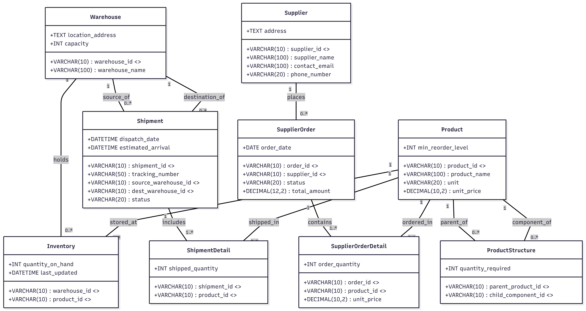

## 2. Database Design (ISO/IEC 19505 / IE Standards)

### 2.1 Conceptual Model (EER / UML Class Diagram)

#### A. Conceptual Diagram

---

#### B. Entity/Class Descriptions

* **`Warehouse` (Warehouse Location):**
  * **Description:** Represents physical warehouse facilities within the logistics network where products are stored.
  * **Attributes:** `warehouse_id` (PK, VARCHAR(10)), `warehouse_name` (VARCHAR(100)), `location_address` (TEXT), `capacity` (INT).

* **`Product` (Product / Component Item):**
  * **Description:** Represents inventory items, raw materials, intermediate sub-assemblies, or finished goods.
  * **Attributes:** `product_id` (PK, VARCHAR(10)), `product_name` (VARCHAR(100)), `unit` (VARCHAR(20)), `unit_price` (DECIMAL(10,2)), `min_reorder_level` (INT).

* **`Supplier` (External Vendor):**
  * **Description:** Represents external vendors providing products, parts, or materials.
  * **Attributes:** `supplier_id` (PK, VARCHAR(10)), `supplier_name` (VARCHAR(100)), `contact_email` (VARCHAR(100)), `phone_number` (VARCHAR(20)), `address` (TEXT).

* **`SupplierOrder` (Procurement Order):**
  * **Description:** Represents purchase orders issued to vendors for stock replenishment.
  * **Attributes:** `order_id` (PK, VARCHAR(10)), `supplier_id` (FK, VARCHAR(10)), `order_date` (DATE), `status` (VARCHAR(20)), `total_amount` (DECIMAL(12,2)).

* **`Shipment` (Warehouse Inter-Transfer Logistics):**
  * **Description:** Tracks product transport operations moving inventory between physical warehouses.
  * **Attributes:** `shipment_id` (PK, VARCHAR(10)), `tracking_number` (VARCHAR(50)), `source_warehouse_id` (FK, VARCHAR(10)), `dest_warehouse_id` (FK, VARCHAR(10)), `dispatch_date` (DATETIME), `estimated_arrival` (DATETIME), `status` (VARCHAR(20)).

* **`Inventory` (Stock Balance per Location - Association Entity):**
  * **Description:** Tracks real-time stock balances for specific product-warehouse pairs.
  * **Attributes:** `warehouse_id` (PK, FK, VARCHAR(10)), `product_id` (PK, FK, VARCHAR(10)), `quantity_on_hand` (INT), `last_updated` (DATETIME).

* **`ProductStructure` (Bill of Materials - Recursive Association Entity):**
  * **Description:** Maps parent-child assembly components for recursive Bill of Materials tracking.
  * **Attributes:** `parent_product_id` (PK, FK, VARCHAR(10)), `child_component_id` (PK, FK, VARCHAR(10)), `quantity_required` (INT).

* **`SupplierOrderDetail` (Order Line Items - Association Entity):**
  * **Description:** Represents individual item quantities and pricing within a procurement order.
  * **Attributes:** `order_id` (PK, FK, VARCHAR(10)), `product_id` (PK, FK, VARCHAR(10)), `order_quantity` (INT), `unit_price` (DECIMAL(10,2)).

* **`ShipmentDetail` (Shipment Line Items - Association Entity):**
  * **Description:** Details the item quantities contained inside an inter-warehouse shipment.
  * **Attributes:** `shipment_id` (PK, FK, VARCHAR(10)), `product_id` (PK, FK, VARCHAR(10)), `shipped_quantity` (INT).

---

#### C. Resolution of Core Database Challenges

* **Recursive Relationship (Bill of Materials - BOM Assembly):**
  * **Challenge:** Products can be composed of multiple sub-components, while a sub-component can be utilized across multiple parent products.
  * **UML Solution:** Modeled as a **Self-Association (Recursive Many-to-Many Relationship)** on the `Product` entity through the `ProductStructure` association class.
  * **Key Fields:** `parent_product_id` (FK to `Product`), `child_component_id` (FK to `Product`), and `quantity_required`.

* **Multi-Warehouse Inventory & Restock Alerts:**
  * **Challenge:** Managing individual stock levels across multiple locations and triggering replenishment alerts.
  * **UML Solution:** Resolved via the `Inventory` association entity bridging `Warehouse` (`1..*`) and `Product` (`0..*`).
  * **Key Logic:** The real-time physical balance `quantity_on_hand` stored in `Inventory` is dynamically compared against `min_reorder_level` in `Product` to raise automated restock flags.

---

#### D. Multiplicity Summary

* **`Supplier` to `SupplierOrder` (`1` : `0..*`):** A supplier can be linked to zero or multiple procurement orders; each order belongs to exactly one supplier.
* **`Warehouse` to `Inventory` (`1` : `0..*`):** A warehouse contains zero or multiple inventory stock records; each inventory record belongs to one specific warehouse.
* **`Product` to `Inventory` (`1` : `0..*`):** A product can be held across zero or multiple physical warehouses.
* **`Warehouse` to `Shipment` (`1` : `0..*`):** A warehouse can act as a source or destination for zero or multiple shipments.
* **`Product` to `ProductStructure` (`1` : `0..*`):** A product can act as a parent assembly to multiple child parts, or as a sub-component inside multiple higher-level products.